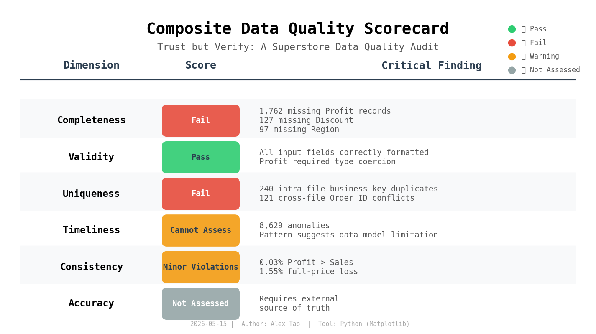

# Trust but Verify: A Superstore data quality audit project

## Description
The data quality assessment of the Superstore sales data is to determine whether it is suitable for the business reporting (e.g, financial and operational reporting)

## Business question
Can the exesctives trust the Superstore dashboard to make decisions about the regional sales. discount strategy, and profitability?

The executives rely on the allocated and cleaned data, visualized through the composite dashboard, to develop strategy and make high-stakes decisions. If the underlying data cannot be trusted, neither can the decisions built upon it. This project audits the data across six dimensions to answer the trust question with evidence.

## Structure
```
.
├── composite_scorecard.png
├── data
│   ├── Superstore_Orders_q1.csv
│   └── Superstore_Orders_q2.csv
├── notebooks
│   ├── 01_completeness.ipynb
│   ├── 02_validity.ipynb
│   ├── 03_uniqueness.ipynb
│   ├── 04_timeliness.ipynb
│   ├── 05_consistency.ipynb
│   ├── 06_accuracy.ipynb
│   └── 07_composite_scorecard.ipynb
└── README.md
```

## Composite Data Quality Scoreboard


## Key Findings

**Conclusion: NOT FIT for financial reporting without remediation.**

## Methodology

Standard six-dimension data quality framework:

- **Completeness:** Are required fields present?
- **Validity:** Do values conform to expected formats and ranges?
- **Uniqueness:** Are there duplicate records?
- **Timeliness:** Is the data current and past logicial?
- **Consistency:** Does data contradict itself across fields?
- **Accuracy:** Does data match an external source of truth?

## Tools and Technologies

- **Language:** Python 3.x
- **Libraries:** Pandas, NumPy, Matplotlib
- **Environemnt:** Jupyter Notebook
- **Version Control:** Git & GitHub

## About this project:

This project is built as part of a professional portfolio to demonstrate end-to-end data quality assessment skills. It reflects a transition from tactical data cleaning to strategic data quality analysis, with a focus on expressing business risk to non-technical stakeholders.

## Author
Name: Siyuan Tao
LinkedIn: www.linkedin.com/in/alext41
Email: peachalex233@gmail.com